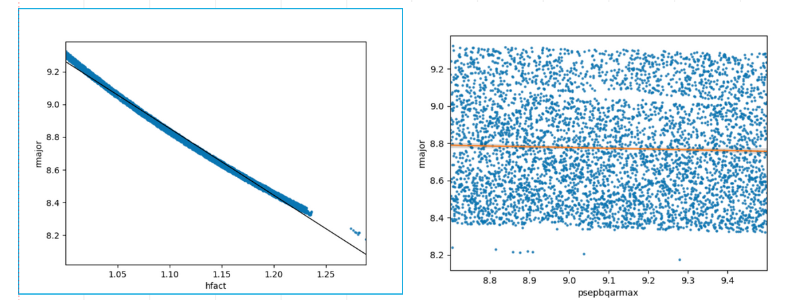
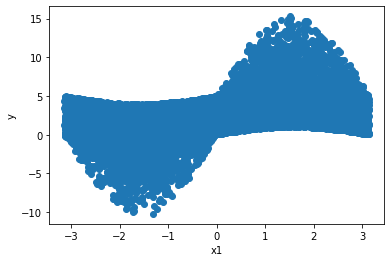
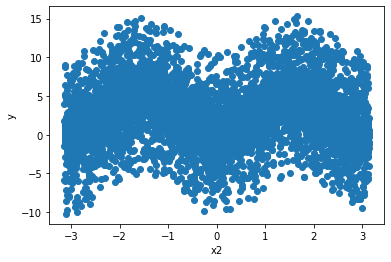
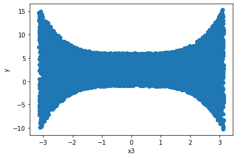

# interval-sensitivity

## Explanation

The objective is to find a method of sensitivity analysis which does not rely on derivatives or distributions (variances). Ideally, it should not rely on regression or interpolations either.
Why:
1) Derivative-based methods require knowing the analytical expression of the function of interest;
2) Distribution-based approaches assume that the probability density functions assigned to the problem variables are right;
3) Regression or interpolation-based approaches may introduce some bias and may not be 'absolutely objective', in the sense that they could require of some specific variables introduced by the user.

There are some problems where the model functions are not available, because the model behaves as a black box or the complexity of the model is such that the functions are difficult to disentangle from each other. Also, it could be the case that the analyst cannot assign probability distribution functions to the problem variables reliably because the model under study is dominated by epistemic uncertainties. Finally, it would be desirable to find a method that does not introduce any extra noise into the analysis, as regression or interpolations could do.

## Approach

The motivation comes from this example. The figures show the pair of points (hfact,rmajor) and (psepbqarmax,rmajor) for rmajor=f(hfact,psepbqarmax) with hfact in [1.0,1.3] and psepbqarmax in [8.7,9.5]. We can clearly see that, when hfact and psepbqarmax are uncertain, hfact is a much better predictor of rmajor. This can be rephrased as:
1) rmajor has stronger dependence on hfact than psepbqarmax;
2) the uncertainty in hfact introduces more uncertainty on rmajor than the uncertainty in psepbqarmax;
3) the more we know about hfact, the more we know about rmajor;
4) **picking a value for hfact returns a tighter interval of rmajor than picking a value for psepbqarmax**.

For example, fixing hfact to 1.15 would yield rmajor in ~[8.8,8.7] (i.e. large uncertainty reduction), whilst fixing psepbqarmax to 8.9 the rmajor interval would still be open as originally (i.e. no uncertainty reduction).

So we wonder if it would be possible to rank the variables by how tight the interval of rmajor is.

The initial idea is to get the points that conform the interval (i.e. upper and lower contour), and then perform the Wasserstein distance of such points.
When the Wasserstein distance is zero it means that the upper and lower contour are same, and the variable assigned to those points would rank first in the order of importance, since it would be a perfect predictor of y. Therefore, the smaller the distance, the more important the variable is.

## Tests with Ishigami function

Ishigami function is a well know function used in UQ and SA, and that is the reason it was picked for the initial tests.
Sobol indices of the Ishigami function will serve as a baseline comparison of our results. The main drawback of this function relies on its non-linearity, and this could pose a challenge for the initial tests. Perhaps a less aggressive function is better suited for testing the waters.

Mininum y: -10.232405704793319

Maximum y: 15.306573219961262

Distance: 25.53897892475458
### Idea 1
Perform linear regression (LR). Then use MSE to compute upper and lower bounds on the prediction of the LR. Compute the Wasserstein distance of the upper and lower bounds.

**Results**:

### Idea 2
Use Interval Predictor Models (IPM). Then same procedure as Idea 1.

**Results**:
I don't think IPMs work well with non-linear non-monotonic functions, as it is the case of the Ishigami.

### Idea 3
Find an algorithm to get the experimental upper and lower bounds (i.e. no regression or prediction at all). Then same procedure as Idea 1.

**Results**:
I found that what I was trying to do is something called 'finding the concave hull'. 'Concave' and 'convex' hull are two different things but similar.
I have to read further about alpha shapes and Delaunay triangulation. This is not a trivial problem.

At the moment the code works OK-ish. Problems are that I need to specify an alpha value to perform the selection of points, and this is specific for each variable. Also I need to figure out a method to get rid of the endpoints, but I don't think this introduces a significant amount of noise.

### Idea 4
Use splines.

**Results**: I don't think splines work well with scattered data, since splines need a continuously increasing x variable.
But seems to be a restriction in the software, and not a mathematical requirement. However, I haven't been capable of working this successfully, so I may discard this idea. Perhaps it works well with other kind of problems, but not for the Ishigami function.

### Idea 5
Use splines with data from 3.

**Results**: